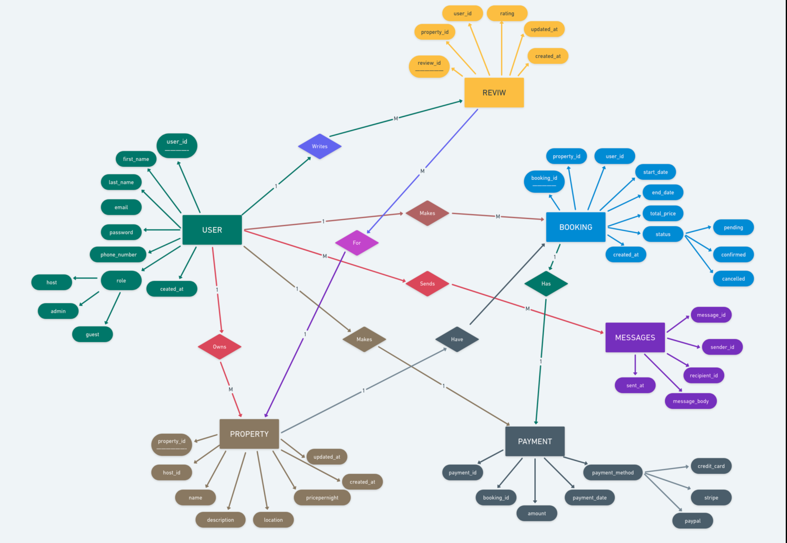

# Airbnb Database Project Requirements

## Overview
This document outlines the database requirements for the Airbnb clone project. The system is designed to manage users, properties, bookings, payments, reviews, and messaging functionality.

## Entity-Relationship Diagram

## Database Entities and Attributes

### 1. 👤 User Entity
- **user_id**: Primary Key, UUID, Indexed
- **first_name**: VARCHAR, NOT NULL
- **last_name**: VARCHAR, NOT NULL
- **email**: VARCHAR, UNIQUE, NOT NULL
- **password_hash**: VARCHAR, NOT NULL
- **phone_number**: VARCHAR, NULL
- **role**: ENUM (guest, host, admin), NOT NULL
- **created_at**: TIMESTAMP, DEFAULT CURRENT_TIMESTAMP

### 2. 🏠 Property Entity
- **property_id**: Primary Key, UUID, Indexed
- **host_id**: Foreign Key → User(user_id)
- **name**: VARCHAR, NOT NULL
- **description**: TEXT, NOT NULL
- **location**: VARCHAR, NOT NULL
- **pricepernight**: DECIMAL, NOT NULL
- **created_at**: TIMESTAMP, DEFAULT CURRENT_TIMESTAMP
- **updated_at**: TIMESTAMP, ON UPDATE CURRENT_TIMESTAMP

### 3. 📅 Booking Entity
- **booking_id**: Primary Key, UUID, Indexed
- **property_id**: Foreign Key → Property(property_id)
- **user_id**: Foreign Key → User(user_id)
- **start_date**: DATE, NOT NULL
- **end_date**: DATE, NOT NULL
- **total_price**: DECIMAL, NOT NULL
- **status**: ENUM (pending, confirmed, canceled), NOT NULL
- **created_at**: TIMESTAMP, DEFAULT CURRENT_TIMESTAMP

### 4. 💳 Payment Entity
- **payment_id**: Primary Key, UUID, Indexed
- **booking_id**: Foreign Key → Booking(booking_id)
- **amount**: DECIMAL, NOT NULL
- **payment_date**: TIMESTAMP, DEFAULT CURRENT_TIMESTAMP
- **payment_method**: ENUM (credit_card, paypal, stripe), NOT NULL

### 5. ⭐ Review Entity
- **review_id**: Primary Key, UUID, Indexed
- **property_id**: Foreign Key → Property(property_id)
- **user_id**: Foreign Key → User(user_id)
- **rating**: INTEGER, CHECK (1-5), NOT NULL
- **comment**: TEXT, NOT NULL
- **created_at**: TIMESTAMP, DEFAULT CURRENT_TIMESTAMP

### 6. 💬 Message Entity
- **message_id**: Primary Key, UUID, Indexed
- **sender_id**: Foreign Key → User(user_id)
- **recipient_id**: Foreign Key → User(user_id)
- **message_body**: TEXT, NOT NULL
- **sent_at**: TIMESTAMP, DEFAULT CURRENT_TIMESTAMP

## Database Constraints

### Unique Constraints
- User email must be unique
- All UUID fields must be unique

### Foreign Key Constraints
- Property: host_id → User(user_id)
- Booking: property_id → Property(property_id), user_id → User(user_id)
- Payment: booking_id → Booking(booking_id)
- Review: property_id → Property(property_id), user_id → User(user_id)
- Message: sender_id → User(user_id), recipient_id → User(user_id)

### Check Constraints
- Review rating must be between 1 and 5
- Booking end_date must be after start_date

## Entity Relationships and Business Rules

### 1. User Relationships 👤
- **As a Host**:
  - Can list multiple properties (1:M)
  - Can receive multiple bookings for their properties
  - Can receive multiple reviews for their properties
  - Can communicate with guests through messages
- **As a Guest**:
  - Can make multiple bookings (1:M)
  - Can write multiple reviews (1:M)
  - Can communicate with hosts through messages
- **Business Rules**:
  - A user must verify their email before becoming a host
  - A user can be both a guest and a host
  - Admin users have special privileges for platform management

### 2. Property Relationships 🏠
- **With Users**:
  - Belongs to one host (M:1)
  - Can be booked by multiple guests
- **With Bookings**:
  - Can have multiple bookings over time (1:M)
  - Cannot have overlapping booking dates
- **With Reviews**:
  - Can receive multiple reviews (1:M)
  - Reviews can only be written by users who have completed a stay
- **Business Rules**:
  - A property must have a valid location and price
  - Property details can only be modified by the owner or admin
  - Property availability is automatically updated based on confirmed bookings

### 3. Booking Relationships 📅
- **With Users**:
  - Created by one guest (M:1)
  - Associated with one property owner
- **With Properties**:
  - References one specific property (M:1)
- **With Payments**:
  - Has one associated payment (1:1)
- **Business Rules**:
  - Booking dates cannot overlap for the same property
  - Total price is calculated based on number of nights and property price
  - Status changes trigger notifications to both guest and host

### 4. Payment Relationships 💳
- **With Bookings**:
  - One payment per booking (1:1)
- **Business Rules**:
  - Payment must be completed for booking to be confirmed
  - Payment amount must match booking total price
  - Supports multiple payment methods (credit card, PayPal, Stripe)

### 5. Review Relationships ⭐
- **With Users**:
  - Written by one guest (M:1)
  - Associated with one property
- **With Properties**:
  - Multiple reviews per property (M:1)
- **Business Rules**:
  - Can only be written after checkout
  - Rating must be between 1 and 5 stars
  - Cannot be modified after submission
  - One review per booking allowed

### 6. Message Relationships 💬
- **With Users**:
  - Connects two users (guest and host)
  - Users can have multiple message threads (M:M)
- **Business Rules**:
  - Messages are ordered by timestamp
  - Users can only message if they have an active booking or inquiry
  - Message history is preserved for record-keeping

## Indexing Strategy
### Primary Indexes
- All primary keys are automatically indexed (user_id, property_id, booking_id, etc.)

### Secondary Indexes
- User table: email
- Property table: property_id
- Booking table: booking_id, property_id
- Payment table: booking_id

## Repository Information
- **GitHub Repository**: alx-airbnb-database
- **Directory**: ERD/
- **File**: requirements.md