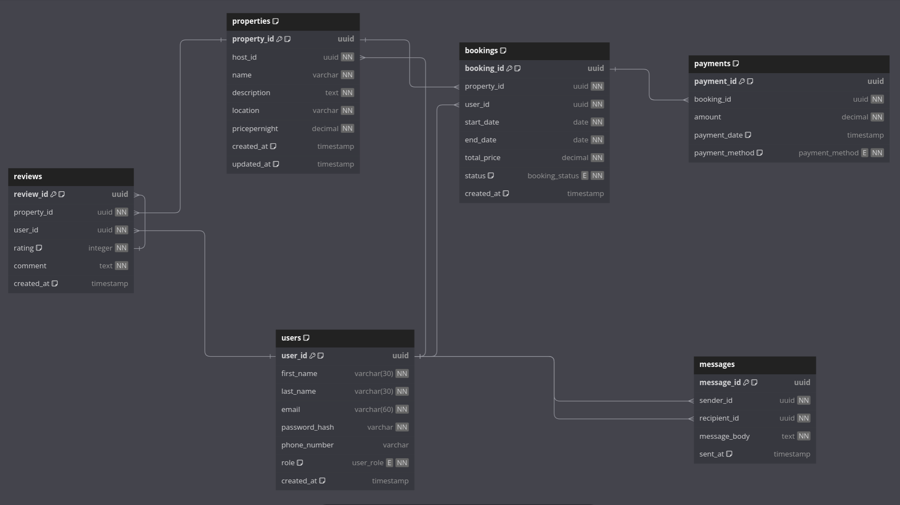

This directory contains the SQL scripts for creating the Airbnb clone database schema based on the provided ERD requirements.

## Schema Overview

The database schema consists of the following tables:

1. `users` - Stores user information (guests, hosts, admins)
2. `properties` - Stores property listings
3. `bookings` - Stores booking information
4. `payments` - Stores payment transactions
5. `reviews` - Stores property reviews
6. `messages` - Stores communication between users

## Schema Design
# Airbnb Database Schem

## Features

- UUID primary keys for all tables
- Proper foreign key constraints
- Automatic timestamp management
- Data integrity constraints
- Role-based user system (guest, host, admin)
- Optimized indexes for better query performance
- Booking status management
- Multiple payment method support

## Schema Details

### Users Table
- Primary key: user_id (UUID)
- Fields: first_name, last_name, email (unique), password_hash, phone_number, role, created_at
- Role types: guest, host, admin

### Properties Table
- Primary key: property_id (UUID)
- Foreign key: host_id (references users)
- Fields: name, description, location, pricepernight, created_at, updated_at

### Bookings Table
- Primary key: booking_id (UUID)
- Foreign keys: property_id, user_id
- Fields: start_date, end_date, total_price, status, created_at
- Status types: pending, confirmed, canceled
- Constraint: end_date must be after start_date

### Payments Table
- Primary key: payment_id (UUID)
- Foreign key: booking_id
- Fields: amount, payment_date, payment_method
- Payment methods: credit_card, paypal, stripe

### Reviews Table
- Primary key: review_id (UUID)
- Foreign keys: property_id, user_id
- Fields: rating, comment, created_at
- Constraint: rating must be between 1 and 5

### Messages Table
- Primary key: message_id (UUID)
- Foreign keys: sender_id, recipient_id (both reference users)
- Fields: message_body, sent_at

## Indexes
- Users: email
- Bookings: property_id, user_id
- Payments: booking_id

## Notes

- All tables use UUID for primary keys for better scalability and security
- Foreign key constraints ensure data integrity
- Indexes are created on frequently queried columns
- Timestamps are automatically managed for relevant fields
